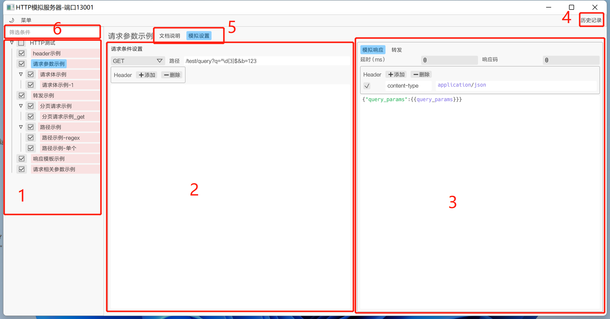
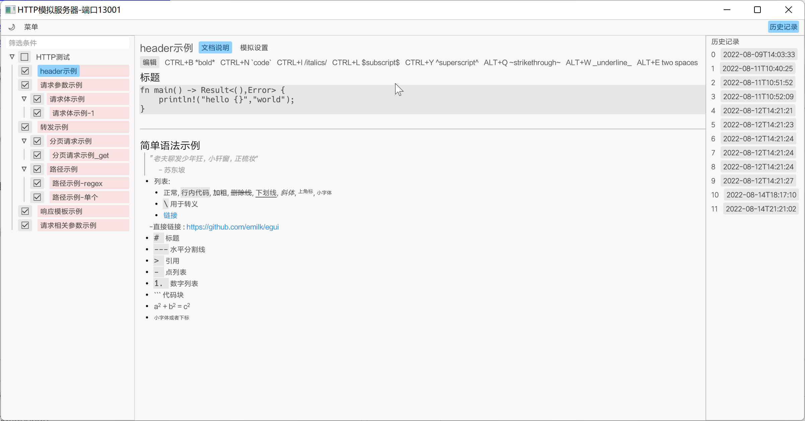
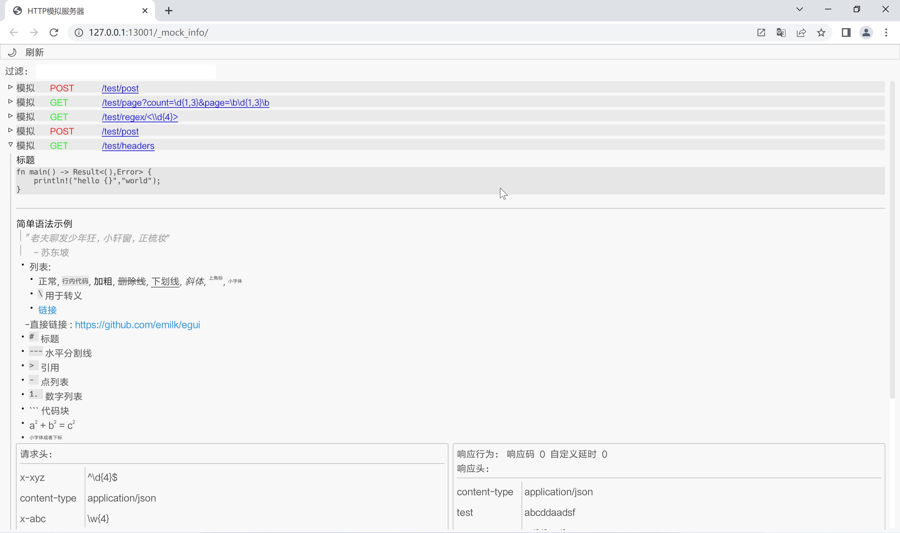
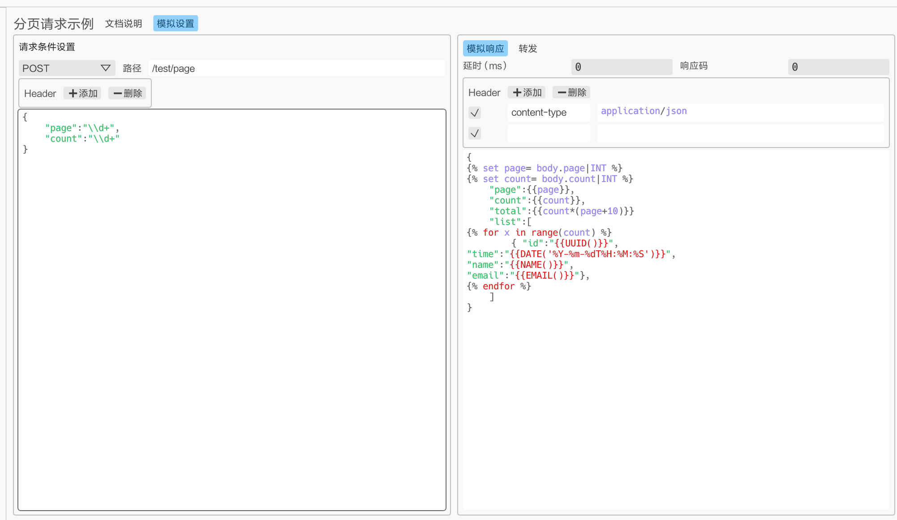
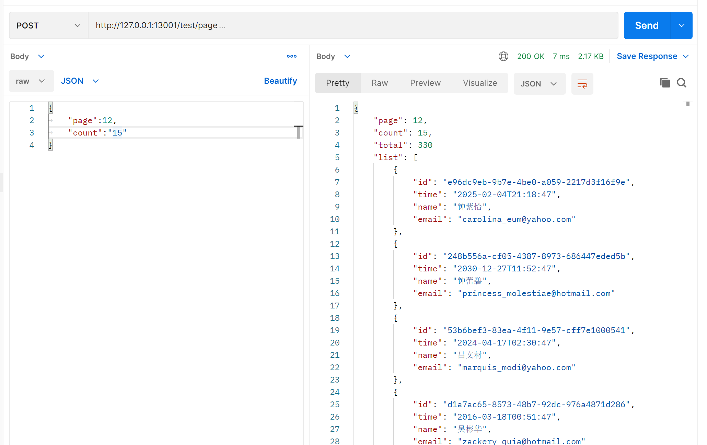

# Http Mock Server

本程序是一个模拟接口响应的独立服务器。本程序根据请求动态生成响应数据，并且可以通过ui界面动态调整。若想使用模拟测试库的话，Java语言可以使用[mockserver](https://github.com/mock-server/mockserver)，Rust则可以使用[httpmock](https://github.com/alexliesenfeld/httpmock)

## 特点介绍

- 定位于小轻便模拟服务器工具，执行程序15Mb。在应对4000的并发的时候，内存占用也才200多Mb。空闲情况下占用内存5M左右。

- 采用异步io。性能强劲。

- 规则配置采用正则表达式校验。

- 有ui配置界面，简单易用，且带简单的语法高亮。

- 以路径为首要条件。不匹配时，返回条件不匹配的信息。

- 采用[Jinja](https://docs.rs/minijinja/latest/minijinja/syntax/index.html)模板引擎。可以根据请求参数设置动态返回响应数据。

## 应用场景

主要用于模拟接口数据、简单的接口管理、动态调整接口数据等场景,定位用户为测试、项目管理人员。ui用于配置控制，运行与本地电脑上。web用于信息展示。

## 构建

1. 安装rust环境
2. clone本仓库代码
3. 运行命令

```shell
cd httpmock-ui 
cargo build -r
cd ../mock_server_web
build_web.bat
```

4. 将mock_server_web下的doc文件夹，和target下的编译好的执行文件，.env文件放同一个文件下面。在.evn中设置好PORT参数，就可以运行了。

## 使用介绍


1. 介绍
   
   - 启动配置：
     
     - 同路径下`.env`文件中`PORT`字段设置模拟服务器的端口。才可以启动。不同端口之间的数据隔离。
   
   - 备份设置：
     
     - 每次关闭时会在同路径下保存一份备份的`json`文件。此文件可通过拖拽或者在菜单中加载进来。注意，这个是会覆盖所有的记录，历史记录除外。
   
   - 配置管理界面
     
     - 配置页面
       
       1. **目录**：选中节点右键可以重命名或者添加子节点。按`DEL`删除本节点以及其子节点；
       
       2. **请求设置界面**：请求头删除时，取消选中要删除的请求头前面的选中框，再点击所有
       
       3. **响应设置界面**：响应可以设置两种类型，模拟数据和转发。模拟数据还可设置延时和响应码。为0则不设置。
       
       4. **历史记录**：会记录每次发往模拟服务器且有变动的模拟规则。
       
       5. 文档说明和模拟设置切换标签；
       
       6. **筛选条件**：筛选名字包含输入字符的目录节点；
   
   
   
   - 文档说明页面
   
   文档支持简单的markmd语法。
   
   
   
   - 查看信息界面(web)[http://localhost:13001/_mock_info/]() 
   
   用于查看模拟服务器服务的规则。支持简单的过滤（标题中包含输入字符则显示）。另外支持 路径后面添加hash(#)来过滤。可用于文档中的链接和跳转。
   
   - 

2. 配置
   
   - 请求设置
     
     1. 路径：
        
        1. 每个配置以路径为key。每个路径可以配置多个规则。按照添加顺序，只要找到一个匹配的配置，就返回对应的模拟数据。
        
        2. 配置路径参数
           
           1. 普通路径参数：例如`test/:a/:b`则匹配任何test\\xxx\xxx的格式的请求。并且在响应中可以通过`{{path.a}}`和{{path.b}}获取到对应位置上的了路径参数的值
           
           2. 正则路径参数：例如`test/<\\d{4}>`匹配任何test\后面跟4个以上的数字的路径。若想在响应模板中获取对应的位置参数，则可以设置这样的`test/:name<\d{4}>`，然后通过`{{path.name}}`来获取。
           
           3. `*`则表示匹配任何路径。例如`test/*name`匹配任何test开头的路径，且后面的字符串都可以通过`{{path.name}}`获取。
        
        3. 请求参数
           
           1. 支持正则表达式匹配。
           
           2. `*`匹配任何字符
           
           3. 可以在模拟请求模板中用`{{query_params}}`获取请求中的参数值；例如`/test/query?q=^\d{3}$&b=123`则匹配类似`/test/query?q=465&b=123`。在模拟设置中可以通过`{{query_params.q}}`和`{{query_params.b}}`获取到对应的465和123的值，类型为字符串。
        
        4. 请求头
           
           1. 支持正则表达式匹配；
           
           2. `*`匹配任何字符；
           
           3. 可以在模拟请求模板中用`{{headers}}`获取请求中的参数值；
        
        5. 请求body
           
           1. 支持正则表达式匹配；
           
           2. 使用{##}编写注释；
           
           3. `*`匹配任何字符,对象；
           
           4. 支持`json`，多级配置。
              
              例如
           
           ```json
           {
           "data":{
               "p1":"\\b\d{3}\\b",{#只匹配3位数字#}
           }
           "p2":"*"{#匹配任意字符对象#}
           }
           ```
           
           在请求响应中，可用`{{body}}`获取整个body的数据。若请求中为json格式，则可以body是个json对象，可以通过`.`获取其属性值。
   
   - 响应设置
     
     - 模拟数据
       
       - 支持[Jinja](https://docs.rs/minijinja/latest/minijinja/syntax/index.html)模板引擎；
       
       - `Ctrl+q`唤出快捷面板，可以快速填充对应的模板方法；
       
       - 自带模板方法说明
         
         - TODO
       
       - 示例说明：
         
         ```json
         {
         
         "name":"{{NAME()}}",
         "email":"{{EMAIL()}}",
         "en_name":"{{NAME('en')}}",
         "add":"{{2*4+3/2}}",
         "aes"："
         {#- AES,Ecb模式加密 -#}
         
         "user":"{{USERNAME()}}",
         "ip4":"{{IPV4()}}"，
         "ip6":"{{IPV6()}}",
         "mac":"{{MAC()}}",
         "UserAgent":"{{USERAGENT()}}",
         ",
         "uuid":"{{UUID()}}",
         "age":"{{NUM(0,120)}}"，
         "now":"{{NOW('%Y-%m-%dT%H:%M:%S')}}",
         "id":"{{NUM_STR(16,16)}}",
         "随机字符串长度":"{{STR(16,16)}}",
         "hex":"{{HEX(16,16)}}",
         "拼接字符串1":"{{DATE('%Y%m%d')}}{{NUM_STR(4,4)}}",
         "拼接字符串2":"{{DATE('%Y%m%d') ~ NUM_STR(4,4)}}",
         "create_time":"{{DATE_BEFORE('%Y-%m-%dT%H:%M:%S','2020-01-01T00:00:00')}}",
         "更新时间":"{{DATE_AFTER('%Y-%m-%dT%H:%M:%S','2022-07-28T00:00:00')}}",
         "time":"{{DATE('%Y-%m-%dT%H:%M:%S')}}",
         "encode":"{{en}}",
         "decode":"{{BASE64_DE(en)}}",
         "list":[
         
             
                 { "id":"{{UUID()}}","time":"{{DATE_ADD(x*24*3600)}}"},
             
         
         ]
         }
         ```
         
         结果：
         
         ```json
         {
         "name":"王雨瑞",
         "email":"monte_saepe@hotmail.com",
         "en_name":"Alysson Waelchi",
         "add":"9.5",
         "aes"："UKB6s2w/qiVCPtwOzsuUePlnjtswIDFnmc0eCKAGe8KJfmo7XEiBNH6tbJ0OB6WSKSGqVpIGhPk7G/7FluO898qBk6JIdi4gL7TGeuJVGxq8Jknb0ZUbw3wl/cnirYDNQ92l9dqKfOW4e54nXuwsxp+UwWZ3AZOV62ENBn4JxOXmaoh8Xl3EGVgPw0CtInH8r4FOdDXyP1R8WxtV6FAh3orGUlTvLBvoxXDrF5eXErKmTD235E1wzzTxQDE/GdiYhpsvmML54toM/WdEjaah1USI4UmB0WJoBf19ZdMHK8dbVVsixjakRteEcpOZTh25zt9tVpgVob2jhwq6kEe42dy89LEsunjysW3u4+eYGjo=",
         "uuid":"3afd0ac0-97c7-41e9-bf79-78f70d35a813",
         "age":"6"，
         "now":"2022-08-15T11:25:08",
         "id":"9635916262395013",
         "随机字符串长度":"7zgbafxe3MRV4cw3",
         "hex":"3091BA84CA98EE7E",
         "拼接字符串1":"201407103750",
         "拼接字符串2":"202311089746",
         "create_time":"2017-10-24T10:31:08",
         "更新时间":"2026-08-19T18:49:00",
         "time":"2026-01-27T15:25:08",
         "encode":"YWJjZDEyMw==",
         "decode":"abcd123",
         "list":[
                 { "id":"a97a6892-a126-4369-ac21-494966059bca","time":"2022-08-15T11:25:08"},
                 { "id":"ce5eb0d2-5112-4102-a763-f2e24e8115a8","time":"2022-08-16T11:25:08"},
                 { "id":"38f281c1-759c-4be6-92d9-11671ff0b7ba","time":"2022-08-17T11:25:08"},
                 { "id":"e8985a8c-0b46-4d04-96cc-2a678d5216ff","time":"2022-08-18T11:25:08"},
                 { "id":"51ec0fec-1a1d-4870-b345-46b616a7af2f","time":"2022-08-19T11:25:08"},
                 { "id":"e37ab859-bdff-4a30-95bf-8c57b0367847","time":"2022-08-20T11:25:08"},
                 { "id":"a048f62f-a024-4296-a693-50298cd0c439","time":"2022-08-21T11:25:08"},
                 { "id":"a75e839a-60b6-441a-b35f-8f0300089def","time":"2022-08-22T11:25:08"},
                 { "id":"e2f6e2c0-9489-4530-aefb-870b41112a77","time":"2022-08-23T11:25:08"},
                 { "id":"b69b06eb-676b-4b2f-984c-765e5b96e9e9","time":"2022-08-24T11:25:08"},
         ]
         }
         ```
     
     - 转发
       
       - 填写完整路径即可

3- 分页请求示例：

   1- 设置：

   由于请求数据中两字段都是字符串，故在响应中用INT转换成整数。若请求是整数，就不用转换，直接使用即可。

   

2. 请求结果
   
   

4. 注意事项
    todo
   
   ## TODO
- [ ] 整理代码，优化ui

- [ ] 添加脚本，可自定义设置变量（包括全局变量）、模板方法和转换器。

- [ ] 添加web多人协同端。